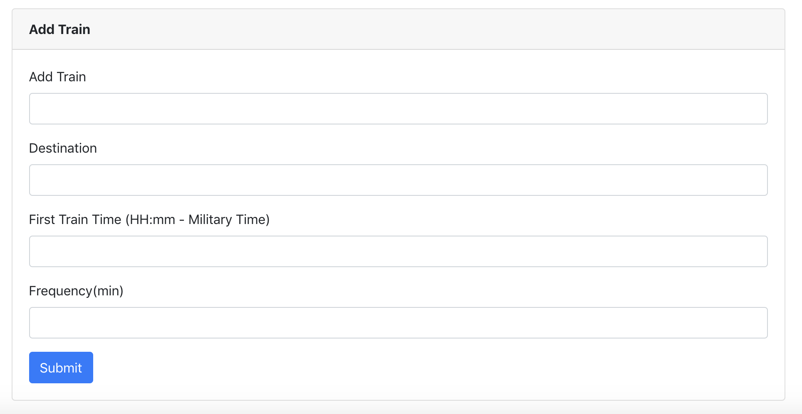

# train-scheduler

A HTML/CSS Browser train scheduler application that uses JavaScript to compose the logic and jQuery for DOM manipulation database initialized through firebase.

### Application

You can view when the next train is scheduled to depart from the station, the frequency of the train and how long till the next train will take to get to the station.

### Add a Train!

You can also input new data into the application and create a new route, frequency and departing time!

### Links

[Train Scheduler Application]( https://kalieshapickering.github.io/train-scheduler/.)